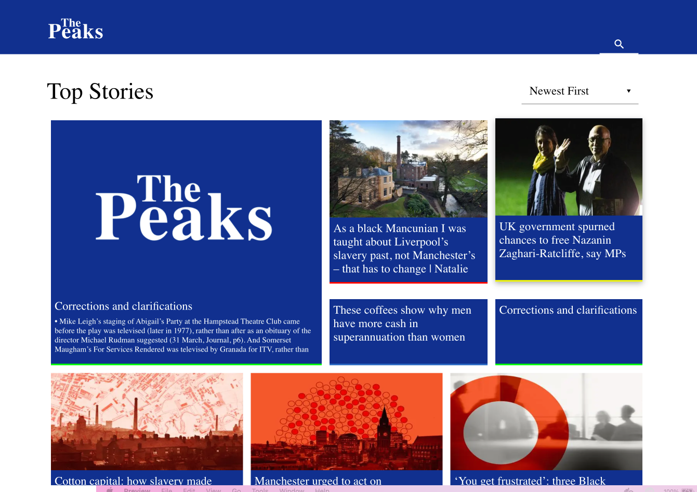
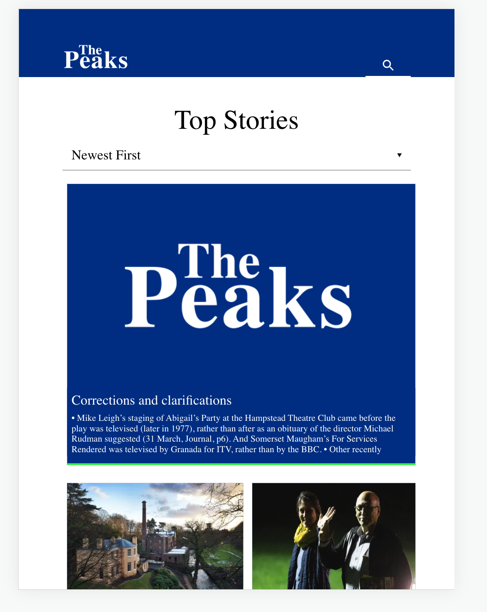
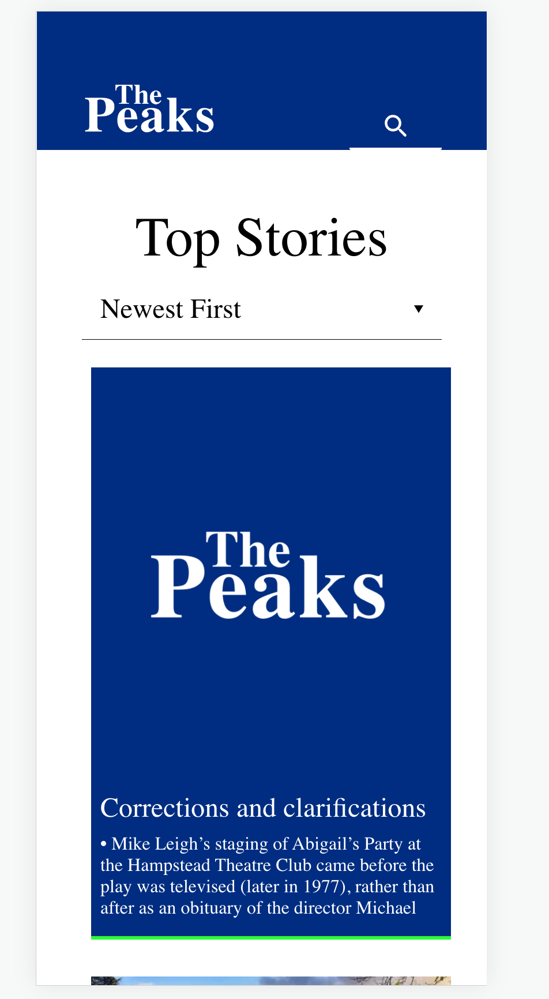

### This is **Front-End Development Test** of seven peaks

---

### Tencinal in project

this project was builded from scratch which using **Typescript** and choose **Nextjs** to structure folder layer with **Atomic Design** pattern that seperate on each component level and also using **Zustand** to manage state in application flow and component.

```
src
├── assets
├── component -> atomic design
│ ├── atoms
│ ├── molecules
│ ├── organisms
│ ├── pages
│ └── utils
├── hook -> custom hook
├── pages
  ├── article
  └── result
```

and also support **Responsive display**

**Desktop**



**Tablet**



**Mobile**



by Nutchapon hanouypornlert.

---

### How to run

1. install dependency

   - npm install

2. start project

   - npm run dev
